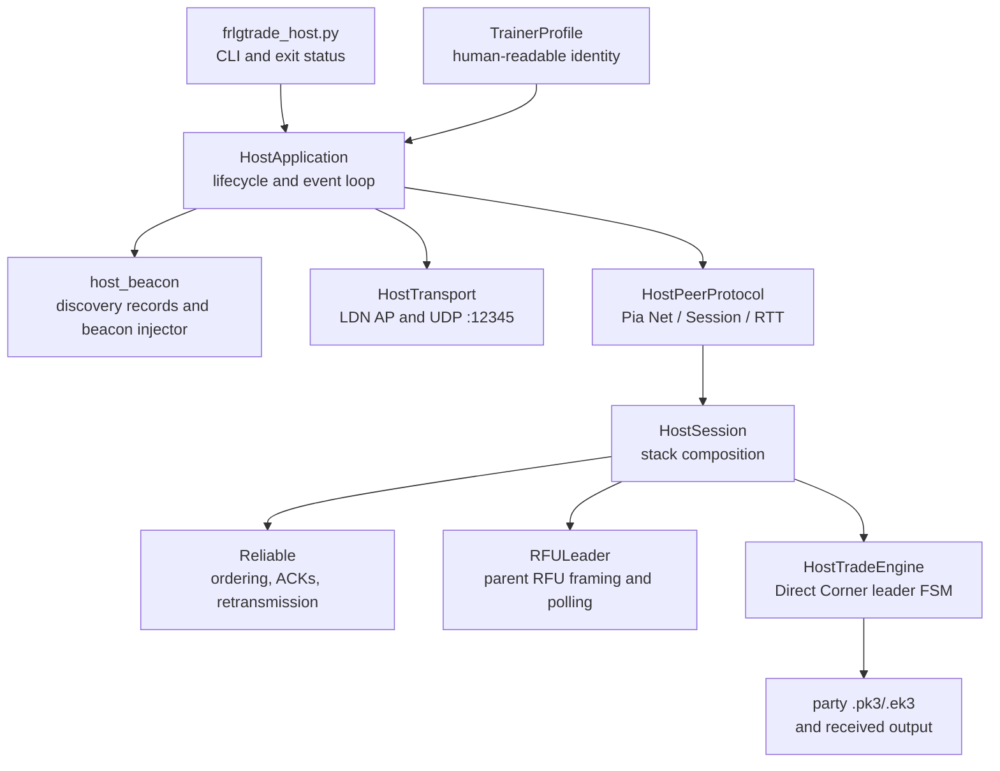
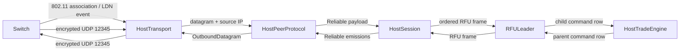
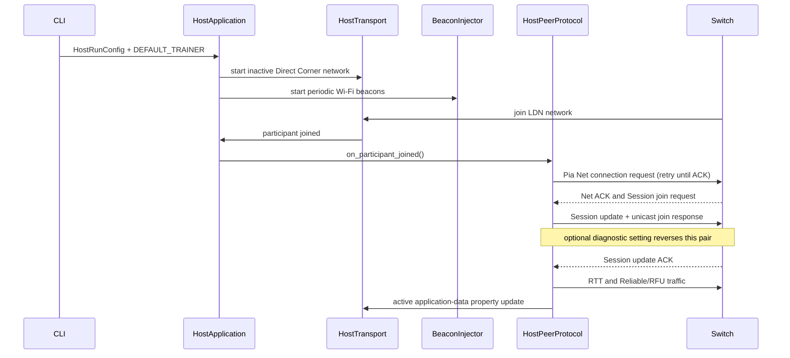
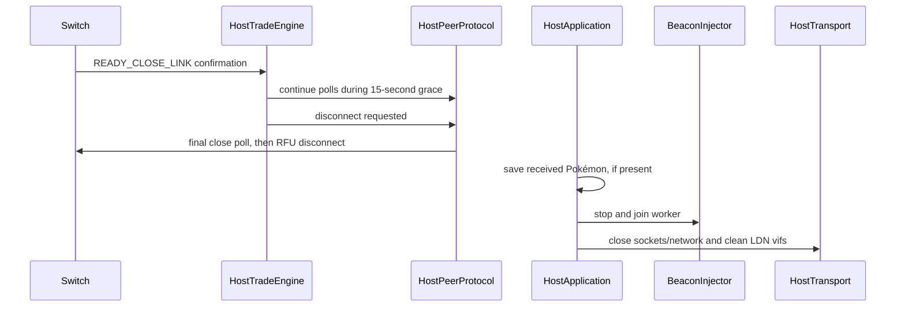
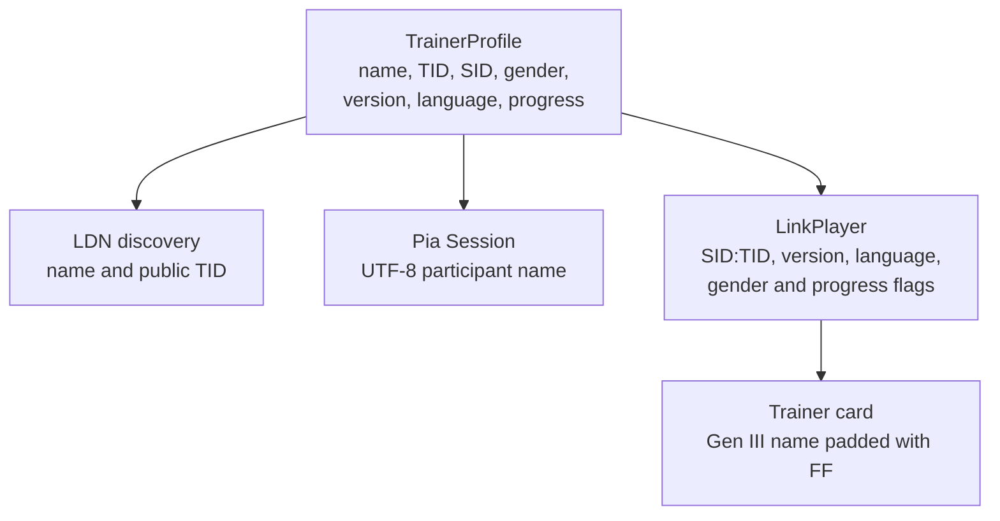

# FRLG trade-host design

`frlgtrade_host.py` makes Linux the FireRed/LeafGreen Direct Corner leader. A single Switch joins
the Linux LDN network, Pia establishes the peer session, and Reliable carries an emulated parent
RFU link whose game-level endpoint is the leader-side trade state machine.

The implementation deliberately keeps the live-tested protocol bytes, message order, retry cadence,
VBlank timing, and disconnect grace period in the layer that owns them. The seams described here
are architectural boundaries, not extra buffering or protocol translation.

## Components and ownership



- `HostRunConfig` is immutable run configuration: party and output choices, trade plan, radio,
  capture, encryption, and protocol diagnostic settings. Trainer identity is intentionally absent.
- `HostApplication` owns resource ordering: input validation, transport startup, beacon injection,
  the event loop, received-Pokémon persistence, interruption handling, and cleanup.
- `HostTransport` owns the LDN AP/network, virtual interfaces, participant events, and UDP sockets.
  It neither parses Pia nor advances the game state machine.
- `HostPeerProtocol` owns one Switch peer's Pia state: Net negotiation and property updates, Session
  acceptance, RTT, packet IDs, native/random nonce selection, encryption/framing, and Reliable
  message batching. It emits transport-independent `OutboundDatagram` values.
- `HostSession` composes Reliable, `RFULeader`, and `HostTradeEngine`. This is the boundary used by
  offline end-to-end tests; it has no socket or LDN dependency.
- `HostTradeEngine` owns the leader-side room entry, party/card exchange, selection and confirmation,
  animation/save barriers, menu cancellation, room exit, and close grace period. `HostTradeTiming`
  names the live-proven frame counts without changing them.
- `BeaconInjector` owns its raw monitor-interface socket and worker thread. `HostApplication` starts
  and stops it with the rest of the runtime resources.

## Data flow



The application loop drains every datagram produced by `HostPeerProtocol` and sends it through
`HostTransport`. Timer deadlines come from the peer protocol, so Net/Session retries, RTT probes,
Reliable retransmission, and the approximately 59.727 Hz protocol tick do not depend on a fixed
polling delay.

## Startup and session establishment



Malformed Pia, invalid padding, failed authentication, incomplete Reliable tiling, and mismatched
Session identities are logged and ignored. A Session request is accepted only when its constant ID,
Pia variables, source IP, and encrypted header agree with the current LDN peer.

## Trade and room-exit lifecycle

```mermaid
stateDiagram-v2
    [*] --> PlayerExchange
    PlayerExchange --> RoomEntry: LinkPlayer and trainer card
    RoomEntry --> PartyExchange: seat route and entry barriers
    PartyExchange --> Selection: party, mail, ribbons
    Selection --> Confirmation: Switch selects; leader offers configured slot
    Confirmation --> Animation: both confirm
    Animation --> Save: trade committed
    Save --> PartyExchange: another configured trade
    Save --> MenuExit: final party refresh
    MenuExit --> RoomExit: both cancel; five-second field wait
    RoomExit --> CloseGrace: Switch confirms room exit
    CloseGrace --> Disconnect: fifteen seconds of peer traffic
    Disconnect --> [*]
```

Room and menu transitions remain two-sided. After the final trade, Linux waits for the Switch trade
menu to become ready; the player selects **CANCEL** and confirms **YES**. The host then finishes the
native standby barriers, waits five seconds before leaving the room, and continues normal peer
traffic for fifteen seconds after the Switch confirms close. Only then is the RFU disconnect queued.
An LDN leave event stops peer output immediately.

## Shutdown and cleanup



The same cleanup runs on normal completion, `KeyboardInterrupt`, startup failure after partial
allocation, and beacon-worker failure. Captures are diagnostic output only and are closed during
cleanup; saving a received Pokémon is independent of capture logging.

## Trainer profile propagation

`frlgsim.host_profile.DEFAULT_TRAINER` is the only user-editable trainer identity. Its immutable
`TrainerProfile` validates the Gen III name and numeric ranges, then derives every protocol view:



TID and SID are combined as `SID << 16 | TID` for game records. Discovery exposes the public TID;
the Pia participant uses the readable name; LinkPlayer and trainer-card data use the Gen III
encoding. Host LinkPlayer/card names use `0xFF` padding, an intentional live-tested serialization
rule rather than profile configuration.

## Failure handling

- Host preflight rejects radios without AP support before LDN creation and identifies the selected
  PHY/driver capability.
- Transport startup and beacon-thread failures abort the run and unwind already-created resources.
- Authentication/decryption and malformed-message failures do not enter the RFU/trade stack.
- Net and Session establishment retry at their proven cadence until acknowledged; RTT samples feed
  Reliable timing once the Session is finalized.
- An unexpected participant leave halts protocol output. After the normal room-close confirmation,
  the host retains the fifteen-second grace period even if the participant disappears, because the
  Switch may still be completing its fade, warp, and bridge teardown.
- Output is written only when a complete received Pokémon exists. Input `.pk3` and `.ek3` files are
  never treated as disposable runtime artifacts.

## Extending the host

Add protocol behavior at the lowest layer that understands it. New CLI settings belong in
`HostRunConfig`; OS/network behavior belongs in the application or transport; Pia messages belong
in `HostPeerProtocol`; RFU behavior belongs in `RFULeader`; and Direct Corner decisions belong in
`HostTradeEngine`. Keep encoders pure where possible and test each boundary using emitted datagrams,
Reliable payloads, RFU frames, or command rows. Do not duplicate trainer fields—derive new identity
representations from `TrainerProfile`.

The current implementation supports one joining Switch. Supporting more peers would require an
explicit `HostPeerProtocol` per participant, independent Pia variables/nonces/packet IDs, and a
game-level RFU policy; increasing the LDN participant limit alone is insufficient.

## Source map

| Source | Responsibility |
|---|---|
| `frlgtrade_host.py` | CLI parsing, configuration construction, application entry point |
| `frlgsim/host_app.py` | `HostRunConfig`, runtime lifecycle, event loop, output and cleanup |
| `frlgsim/host_profile.py` | validated trainer configuration and wire-model conversions |
| `frlgsim/host_beacon.py` | captured trade beacon, discovery mutation, raw beacon injection |
| `frlgsim/host_support.py` | OS-facing support such as sudo-aware key-path resolution |
| `frlgsim/transport.py` | LDN host lifecycle, interfaces, participant events, UDP data plane |
| `frlgsim/host_pia.py` | Pia framing and `HostPeerProtocol` |
| `frlgsim/host_session.py` | Reliable → RFU leader → trade composition |
| `frlgsim/reliable.py` | ordered/retransmitted application channel |
| `frlgsim/rfu_leader.py` | parent RFU framing, NI/UNI handshake, echo table |
| `frlgsim/host_trade.py` | leader trade-room state machine and timing |
| `frlgsim/linkplayer.py` | LinkPlayer and trainer-card encoders |
| `frlgsim/ldntrace.py` | optional JSONL diagnostics |
